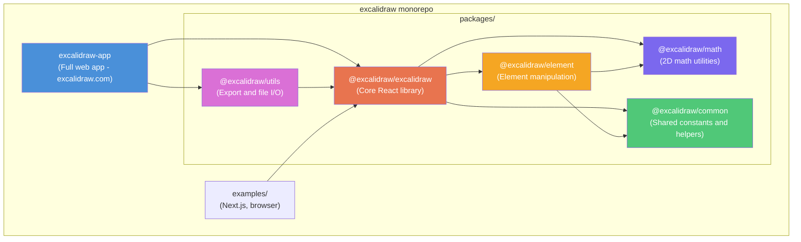
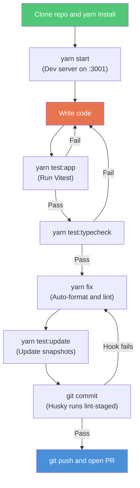
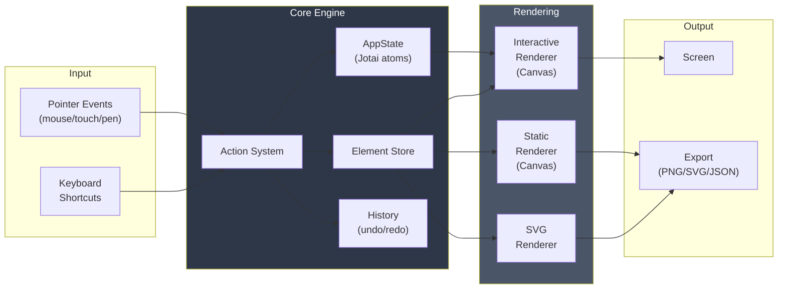
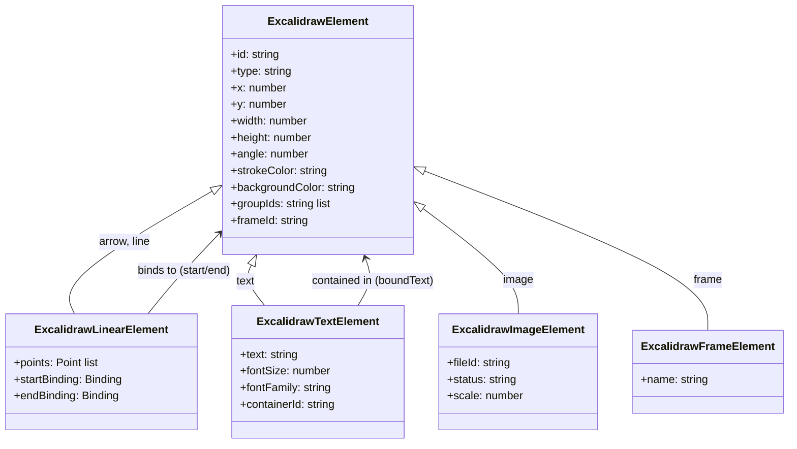
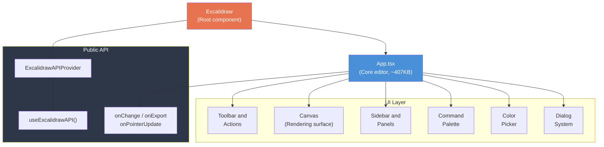
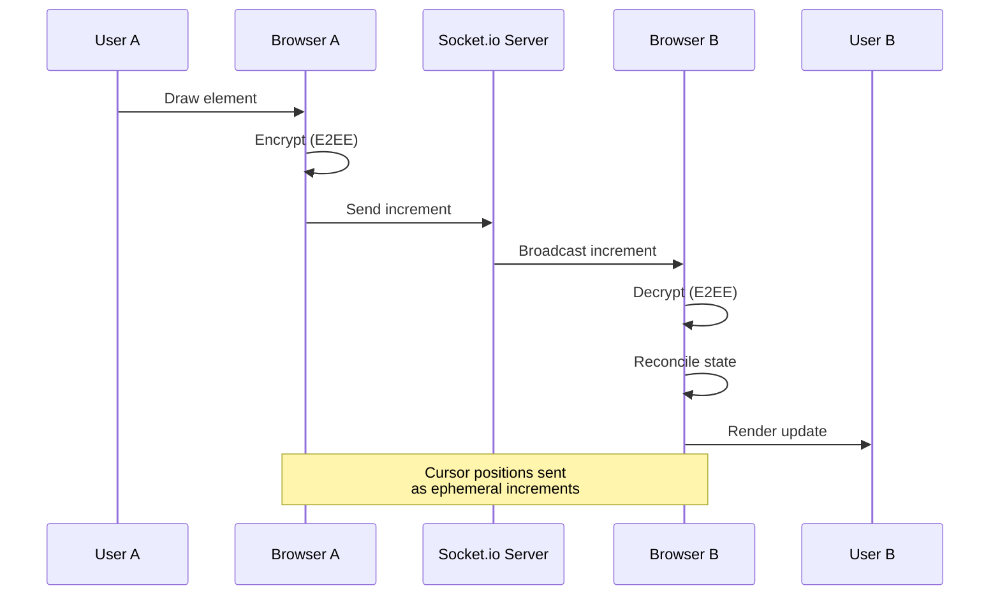
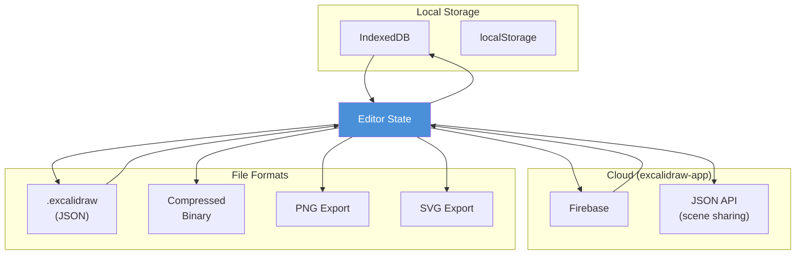

# Excalidraw — Developer Onboarding Guide

Welcome to the Excalidraw codebase. This guide will help you get up and running as a contributor.

## Table of Contents

- [Project Overview](#project-overview)
- [Tech Stack](#tech-stack)
- [Repository Structure](#repository-structure)
- [Getting Started](#getting-started)
- [Development Workflow](#development-workflow)
- [Architecture Overview](#architecture-overview)
- [Key Concepts](#key-concepts)
- [Testing](#testing)
- [Code Quality & Linting](#code-quality--linting)
- [Environment Variables](#environment-variables)
- [Common Tasks](#common-tasks)
- [Codebase Token Evaluation](#codebase-token-evaluation)
- [Troubleshooting](#troubleshooting)
- [Further Reading](#further-reading)

---

## Project Overview

Excalidraw is an open-source, MIT-licensed virtual whiteboard with a hand-drawn aesthetic. It supports infinite canvas, dark mode, real-time collaboration, export (PNG/SVG/JSON), shape libraries, i18n (61+ languages), and more.

The repository is a **Yarn workspaces monorepo** with two main concerns:

1. **`packages/`** — Reusable libraries published to npm (the `@excalidraw/*` family)
2. **`excalidraw-app/`** — The full-featured web application deployed at excalidraw.com

### High-Level Monorepo Map



## Tech Stack

| Category | Technology |
|---|---|
| **UI Framework** | React 19, TypeScript 5.9 |
| **Build** | Vite 5 (app), esbuild (packages) |
| **Package Manager** | Yarn 1.22 (workspaces) |
| **State Management** | Custom editor state (`appState` + `actionManager`); Jotai used in `excalidraw-app/` |
| **Drawing Engine** | RoughJS, perfect-freehand, Canvas API |
| **UI Primitives** | Radix UI |
| **Testing** | Vitest, Testing Library |
| **Collaboration** | Socket.io, Firebase |
| **Error Tracking** | Sentry |
| **Linting/Formatting** | ESLint, Prettier, Husky + lint-staged |

**Node requirement:** >= 18.0.0

## Repository Structure

```
excalidraw/
├── packages/
│   ├── excalidraw/        # Core React component library (@excalidraw/excalidraw)
│   ├── common/            # Shared utilities, constants, colors
│   ├── element/           # Element creation, mutation, geometry, binding
│   ├── math/              # 2D math (vectors, matrices, geometry)
│   └── utils/             # Export helpers, file I/O, format conversion
├── excalidraw-app/        # Full web app (excalidraw.com)
│   ├── App.tsx            # Main app component
│   ├── collab/            # Real-time collaboration
│   ├── data/              # Firebase, storage integration
│   └── share/             # Shareable links, room management
├── examples/              # Integration examples (Next.js, browser script)
├── dev-docs/              # Developer documentation
├── scripts/               # Build & utility scripts
├── firebase-project/      # Firebase configuration
└── public/                # Static assets
```

### Key Packages

**`packages/excalidraw/`** — The main library and largest package:
- `index.tsx` — Entry point; exports `Excalidraw`, `ExcalidrawAPIProvider`, `useExcalidrawAPI()`
- `components/` — React components (`App.tsx` is the core editor)
- `actions/` — action modules (align, clipboard, export, undo/redo, etc.)
- `data/` — Persistence (JSON, blob, encode/decode, restore)
- `renderer/` — Canvas and SVG rendering pipeline
- `scene/` — Scene management, zoom, scroll, export
- `hooks/` — Custom React hooks
- `locales/` — 61+ i18n translation files
- `fonts/` — Font subsetting and loading

**`packages/element/`** — Element manipulation:
- `binding.ts` — Arrow-to-element binding
- `newElement.ts` / `mutateElement.ts` — Create and modify elements
- `bounds.ts` / `collision.ts` — Geometry and hit-testing
- `linearElementEditor.ts` — Path/arrow editing
- `resizeElements.ts` / `dragElements.ts` — Transform operations

**`packages/math/`** — Vector operations, matrix transforms, geometry utilities

**`packages/common/`** — Constants, colors, keyboard mappings, shared helpers

**`packages/utils/`** — PNG/SVG export, file handling, format utilities

## Getting Started

### Prerequisites

- **Node.js** >= 18.0.0
- **Yarn** 1.22.x (v1 Classic)

### Initial Setup

```bash
# Clone the repository
git clone <repo-url>
cd excalidraw

# Install all dependencies (workspaces resolved automatically)
yarn

# Start the development server (excalidraw-app)
yarn start
```

The dev server runs at `http://localhost:3001` by default.

### Clean Reinstall

If you encounter dependency issues:

```bash
yarn clean-install
```

## Development Workflow

### Developer Flow Overview



### Day-to-Day Commands

| Command | Description |
|---|---|
| `yarn start` | Start the dev server (excalidraw-app) |
| `yarn build` | Production build of the app |
| `yarn build:packages` | Build all publishable packages |
| `yarn test:all` | Run the full test suite |
| `yarn test:app` | Run Vitest unit/integration tests |
| `yarn test:typecheck` | TypeScript type checking |
| `yarn test:code` | ESLint checks |
| `yarn test:other` | Prettier formatting checks |
| `yarn fix` | Auto-fix formatting and lint issues |
| `yarn test:update` | Update test snapshots |

### Before Committing

Always run these before pushing:

```bash
yarn test:update      # Update snapshots
yarn test:typecheck   # Ensure types are correct
yarn fix              # Auto-fix lint/format issues
```

Git hooks (Husky + lint-staged) will automatically run ESLint on staged `.js/.ts/.tsx` files and Prettier on `.css/.scss/.json/.md/.html/.yml` files during pre-commit.

## Architecture Overview

### Rendering Pipeline

Excalidraw uses a **Canvas-based rendering** system with three modes:

1. **Interactive rendering** (`interactiveScene.ts`) — Live editor canvas with user interactions
2. **Static rendering** (`staticScene.ts`) — For thumbnails and non-interactive views
3. **SVG rendering** (`staticSvgScene.ts`) — Vector export

The `Renderer` class manages context, caching, and animation frame batching.



### State Management

- Excalidraw uses a **custom state management pattern** in the core editor/library (not Redux/MobX/Zustand).
- `AppState` type defines the core editor state (tool selection, zoom, scroll, theme, etc.) and lives in `packages/excalidraw/types.ts`.
- State updates should flow through the **action system** (see `packages/excalidraw/actions/manager.tsx`) and related action modules.
- Treat state as immutable inputs: **do not mutate state directly**.

Note:

- `excalidraw-app/` also uses **Jotai** for app-shell state (e.g. app-level atoms), but that’s separate from the core editor state architecture.

### Element System

Elements are the core data model. Types include: `rectangle`, `diamond`, `ellipse`, `arrow`, `line`, `freedraw`, `text`, `image`, `frame`, `embeddable`, `magicframe`, and more.



Key relationships:
- **`id`** — Unique element identifier (nanoid)
- **`groupId`** — Groups multiple elements
- **`frameId`** — Associates elements with frames
- **Bindings** — Arrows connect to shapes via `startBinding` / `endBinding`
- **Bound text** — Text elements attached to shapes

### Component Architecture



### Collaboration (excalidraw-app only)



- **Socket.io** for real-time sync
- Durable and ephemeral increments for operations
- Collaborator cursor/pointer tracking
- End-to-end encryption for room data

### Data Persistence



- **Local**: IndexedDB / localStorage
- **Cloud**: Firebase (in excalidraw-app)
- **File formats**: `.excalidraw` (JSON), compressed binary
- Schema migrations handled via `restore` / `reconcile` logic

## Key Concepts

### Path Aliases

TypeScript path aliases map `@excalidraw/*` to the corresponding packages. These are configured in `tsconfig.json` and mirrored in `vitest.config.mts` for test resolution:

- `@excalidraw/common` → `packages/common`
- `@excalidraw/element` → `packages/element`
- `@excalidraw/math` → `packages/math`
- `@excalidraw/utils` → `packages/utils`
- `@excalidraw/excalidraw` → `packages/excalidraw`

### Build System

- **App** — Vite bundles `excalidraw-app` with PWA, SVG-as-component, and sitemap plugins
- **Packages** — esbuild produces `dist/` with dev/prod variants; TypeScript declarations generated separately via `gen:types`
- Only `packages/*` are published to npm; `excalidraw-app` deploys to Vercel

### Input Handling

- Shortcut registry system with key combination mapping
- Gesture detection for touch devices
- Unified pointer events (mouse, touch, pen)

## Testing

### Setup

Tests use **Vitest** with a **jsdom** environment. The setup file (`setupTests.ts`) provides:

- Canvas mocking (`vitest-canvas-mock`)
- Testing Library Jest-DOM matchers
- Fake IndexedDB
- Window API mocks (`FontFace`, `matchMedia`, `fonts`)
- Font loading mock (reads local files)

### Running Tests

```bash
yarn test:app              # Run all Vitest tests
yarn test:app -- --watch   # Watch mode
yarn test:coverage         # Generate coverage report
yarn test:update           # Update snapshots
```

### Coverage Thresholds

| Metric | Minimum |
|---|---|
| Lines | 60% |
| Statements | 60% |
| Branches | 70% |
| Functions | 63% |

### Writing Tests

- Test files: `*.test.ts` or `*.test.tsx`, colocated with source
- Use Testing Library for component tests
- Snapshot tests are supported — run `yarn test:update` after intentional changes

## Code Quality & Linting

### ESLint

- Extends `@excalidraw/eslint-config` and `react-app`
- Enforces import ordering (`@excalidraw/*` after external packages)
- Enforces type-only imports via TypeScript plugin
- Restricts direct imports from barrel `index` files
- Custom rules for Jotai usage

### Prettier

- Configured via `@excalidraw/prettier-config`
- Covers `.css`, `.scss`, `.json`, `.md`, `.html`, `.yml`

### Git Hooks

- **Pre-commit** (Husky + lint-staged): ESLint `--max-warnings=0 --fix` on code files, Prettier on config/style files

## Environment Variables

All prefixed with `VITE_APP_` for Vite exposure to the client.

### Development Defaults (`.env.development`)

| Variable | Value |
|---|---|
| `VITE_APP_BACKEND_V2_GET_URL` | `https://json-dev.excalidraw.com/api/v2/` |
| `VITE_APP_BACKEND_V2_POST_URL` | `https://json-dev.excalidraw.com/api/v2/post/` |
| `VITE_APP_WS_SERVER_URL` | `http://localhost:3002` |
| `VITE_APP_PORT` | `3001` |
| `VITE_APP_ENABLE_TRACKING` | `true` |
| `VITE_APP_ENABLE_PWA` | `false` |

### Production Overrides (`.env.production`)

| Variable | Value |
|---|---|
| `VITE_APP_BACKEND_V2_GET_URL` | `https://json.excalidraw.com/api/v2/` |
| `VITE_APP_WS_SERVER_URL` | `https://oss-collab.excalidraw.com` |

### Other Notable Variables

- `VITE_APP_LIBRARY_URL` — Shape library CDN
- `VITE_APP_AI_BACKEND` — AI service endpoint
- `VITE_APP_FIREBASE_CONFIG` — Firebase credentials
- `VITE_APP_PLUS_LP` / `VITE_APP_PLUS_APP` — Excalidraw+ URLs
- `VITE_APP_DEBUG_*` — Debug flags

## Common Tasks

### Adding a New Element Type

1. Define the type in `packages/element/types.ts`
2. Add creation logic in `packages/element/newElement.ts`
3. Implement rendering in `packages/excalidraw/renderer/`
4. Add the toolbar action in `packages/excalidraw/actions/`
5. Update restore/migration logic in `packages/excalidraw/data/restore.ts`

### Adding a New Action

1. Create a file in `packages/excalidraw/actions/`
2. Define the action using the `Action` type (name, perform, keyTest, etc.)
3. Register it in the action manager

### Adding a Translation

1. Add the key to `packages/excalidraw/locales/en.json`
2. Use `t()` or the `useI18n()` hook in components
3. Translations for other languages are community-contributed

### Building Just the Library

```bash
yarn build:packages
```

Output goes to each package's `dist/` directory.

### Using the Library in Another Project

```bash
npm install @excalidraw/excalidraw
```

```tsx
import { Excalidraw } from "@excalidraw/excalidraw";

function App() {
  return <Excalidraw onChange={(elements, state) => console.log(elements)} />;
}
```

See `examples/` for Next.js and browser-script integrations.

## Codebase Token Evaluation

Understanding rough token sizes helps plan LLM-assisted development, code reviews, and context-window budgeting.

### Methodology (reproducible)

There’s no single “true” token count because it depends on the tokenizer/model. Use estimates and keep them reproducible.

- **Estimate from characters**:
  - Prose: \(tokens \approx \frac{chars}{4}\)
  - Code/JSON (denser): \(tokens \approx \frac{chars}{3}\)
- **What to include**: typically source + config, excluding generated output.
- **What to exclude**: `node_modules/`, `dist/`, `build/`, `.git/` (and other generated artifacts).

### Quick local estimation commands

Count characters for selected directories (example focuses on the code people edit most):

```bash
# Characters (rough proxy for tokens)
python3 - <<'PY'
import pathlib

include_ext = {".ts",".tsx",".js",".jsx",".css",".scss",".json",".md",".yml",".yaml",".html"}
exclude_dirs = {"node_modules",".git","dist","build","coverage"}
roots = ["packages/excalidraw","packages/element","packages/common","packages/math","packages/utils","excalidraw-app"]

def iter_files(root):
    root = pathlib.Path(root)
    for p in root.rglob("*"):
        if p.is_dir() and p.name in exclude_dirs:
            # skipping: rglob will still walk into it, so we filter in file loop
            continue
        if p.is_file() and p.suffix in include_ext and not any(part in exclude_dirs for part in p.parts):
            yield p

total_chars = 0
by_root = {}
for r in roots:
    chars = 0
    for f in iter_files(r):
        try:
            chars += len(f.read_text(encoding="utf-8", errors="ignore"))
        except Exception:
            pass
    by_root[r] = chars
    total_chars += chars

print("Total chars:", total_chars)
print("Est. tokens (chars/3):", total_chars // 3)
print("Est. tokens (chars/4):", total_chars // 4)
print()
for r, c in sorted(by_root.items(), key=lambda kv: kv[1], reverse=True):
    print(f"{r:24} chars={c:,}  est_tokens(chars/3)={c//3:,}")
PY
```

Use this to decide what to load into an LLM context window:

- Prefer **excluding** `packages/excalidraw/locales/` for code reasoning.
- Start with `packages/element/` for rendering/geometry work and only pull in relevant slices of `packages/excalidraw/`.

---

## Troubleshooting

| Issue | Solution |
|---|---|
| Dependencies won't install | Run `yarn clean-install` to wipe and reinstall |
| Type errors after pulling | Run `yarn test:typecheck` to identify issues |
| Snapshot tests failing | Run `yarn test:update` to regenerate snapshots |
| Port 3001 in use | Set `VITE_APP_PORT` in `.env.development.local` |
| Canvas tests failing locally | Ensure `vitest-canvas-mock` is set up — check `setupTests.ts` |
| Path alias not resolving | Verify `tsconfig.json` and `vitest.config.mts` are in sync |

---

## Further Reading

- [Excalidraw Developer Docs](https://docs.excalidraw.com)
- [Contributing Guide](https://docs.excalidraw.com/docs/introduction/contributing)
- `dev-docs/` directory in the repository
- `CLAUDE.md` at the project root for AI-assisted development notes